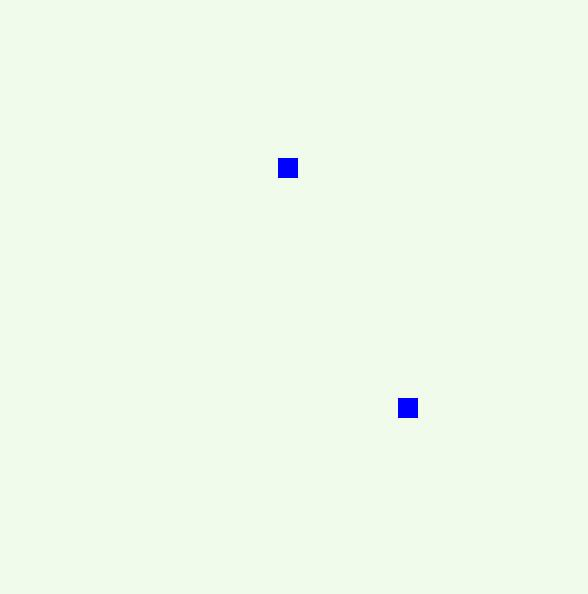
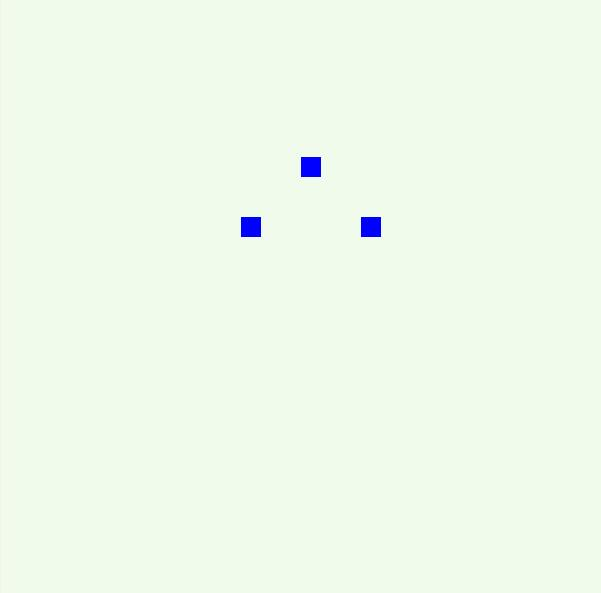

# MoveBlock
这个游戏名为移动的方块

这是一个非常简单的游戏，就是通过键盘的方向键移动方块。之所以我会选择做这个小游戏也是因为之前用js做过贪吃蛇，
是单机的，只能在网页上移动。就想通过php的一些socket框架，实现多人同时在线玩游戏。php的socket框架有：比如纯php实现的workerman和用纯C实现的swoole扩展，这个小游戏就是用workerman框架做的socket
服务端。

# 试玩地址 120.27.117.52:8886/box.html
## 下面是一些截图方便大家了解

